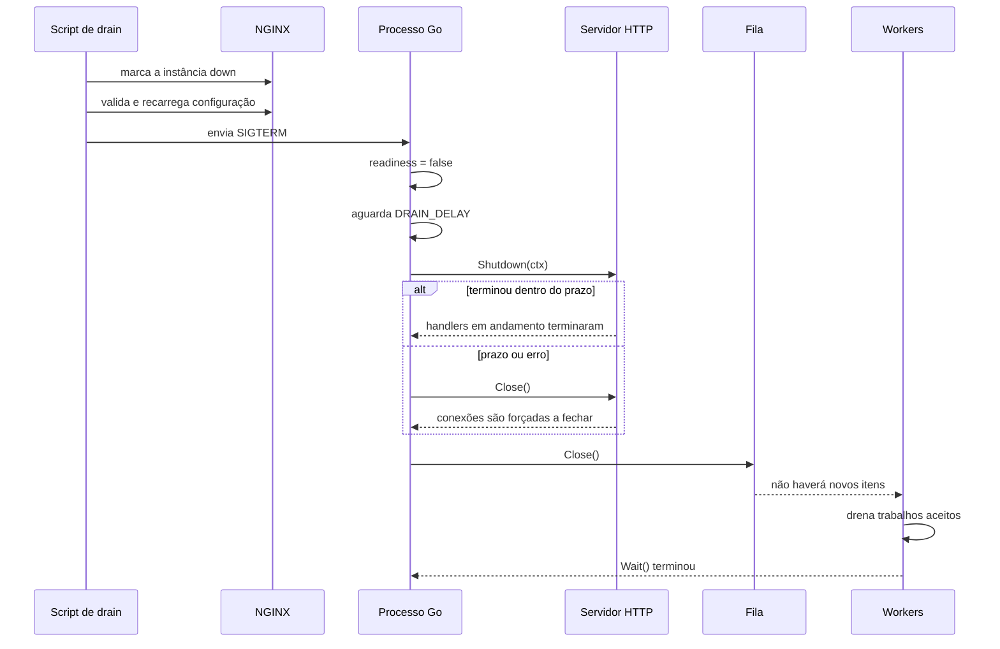
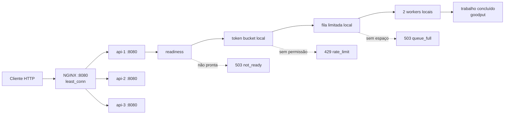

# Aula 08 — referência de código: admitir, distribuir e encerrar sem abandonar trabalho

Este módulo é a implementação de referência da Aula 08. Ele continua o laboratório de fila limitada e worker pool, acrescentando as decisões que aparecem quando existem várias cópias da API atrás de um balanceador.

O exemplo é pequeno de propósito, mas não é abstrato: o NGINX recebe o tráfego na porta `8080`; três processos Go chamados `api-1`, `api-2` e `api-3` recebem as requisições distribuídas; cada processo possui seu próprio token bucket, sua própria fila em memória e seus próprios workers.

Alguns nomes serão usados desde o começo:

- **requisição HTTP:** a mensagem que um cliente envia para pedir uma operação à API;
- **instância:** uma cópia do programa em execução; `api-1`, `api-2` e `api-3` executam o mesmo código, mas possuem memória independente;
- **NGINX:** software usado aqui para receber HTTP na frente das instâncias e escolher um destino;
- **token bucket:** recipiente lógico de permissões que controla a entrada;
- **Job:** unidade de trabalho criada pela API, como processar um pedido;
- **Queue:** fila limitada onde um Job aceito aguarda até poder ser processado;
- **worker:** uma goroutine de vida longa que retira um trabalho da fila, processa e volta a esperar o próximo;
- **Pool:** conjunto fixo de workers administrados em grupo;
- **handler:** função chamada pelo servidor para tratar uma rota HTTP e escrever a resposta;
- **requisição HTTP in-flight:** handler que começou, mas ainda não terminou de escrever a resposta;
- **Job in-flight:** Job que já saiu da Queue e ainda está sendo processado por um worker.

Uma **goroutine** é uma função executada concorrentemente pelo runtime do Go. Concorrentemente significa que vários fluxos de execução podem progredir no mesmo período; isso não implica que exista um núcleo de CPU exclusivo para cada um.

O pacote Go chamado `jobs` reúne `Job`, `Queue` e `Pool`. Depois de um `202 Accepted`, a requisição HTTP já pode ter terminado enquanto o Job continua queued, esperando na Queue, ou in-flight, executando em um worker.

## O problema que o código resolve

Uma API pode continuar recebendo conexões mesmo quando já não consegue transformar novas requisições em trabalho útil. Se ela aceitar tudo, a espera cresce, a memória é ocupada, os timeouts começam e parte do processamento termina tarde demais para servir ao cliente.

Este projeto aplica quatro decisões em lugares diferentes:

1. o NGINX escolhe **qual instância** receberá a requisição;
2. o token bucket decide se **uma nova operação pode entrar agora**;
3. a fila limitada decide se **existe espaço para esperar**;
4. o shutdown gracioso decide **como parar sem abandonar o que já foi aceito**.

## Conceitos antes do código

### Balanceador de carga

Um balanceador de carga é um componente que recebe uma requisição em um endereço conhecido e escolhe uma entre várias instâncias capazes de atendê-la. Ele fica entre o cliente e as APIs; quando encaminha HTTP dessa forma, também exerce o papel de **proxy reverso**.

Neste laboratório, o balanceador é concretamente o **NGINX**, um software que pode atuar como servidor HTTP e proxy reverso. O cliente chama `http://127.0.0.1:8080`; ele não conhece as portas individuais. O NGINX encaminha a requisição para `api-1:8080`, `api-2:8080` ou `api-3:8080`.

Essas três instâncias formam o **upstream**: o conjunto de servidores de destino disponíveis para o NGINX. O Docker Compose inicia os quatro containers e cria uma rede local em que nomes como `api-2` funcionam como endereços. Um container é um processo isolado construído a partir de uma imagem; aqui ele serve apenas para reproduzir a topologia na máquina local.

A diretiva `least_conn` escolhe a instância com menos conexões ativas. Ela é útil quando algumas requisições demoram mais que outras. Se houver empate, a escolha alterna entre as instâncias.

Outras escolhas comuns ajudam a distinguir produto de algoritmo:

- **round-robin:** envia a próxima requisição para a próxima instância da sequência;
- **least connections:** envia para a instância com menos conexões ativas;
- **IP hash:** usa o IP do cliente para tentar mantê-lo na mesma instância.

NGINX é o produto; `least_conn` é o algoritmo configurado neste produto. Esses algoritmos normalmente não conhecem tokens, profundidade da Queue nem Jobs nos workers. No projeto assíncrono, o NGINX deixa de contar a requisição quando recebe o `202`, mesmo que o Job continue na aplicação. Portanto, “menos conexões HTTP” não significa necessariamente “menos Jobs”.

O balanceador distribui trabalho; ele não cria capacidade dentro de uma instância. Três processos com oito trabalhos úteis por segundo cada oferecem aproximadamente 24 trabalhos úteis por segundo enquanto os demais recursos não virarem o gargalo. Se houver apenas uma instância, o balanceamento entre cópias não traz benefício; e, se todas as instâncias dependem do mesmo banco saturado, adicionar o NGINX não corrige esse gargalo compartilhado.

### Taxa, concorrência, fila e capacidade não são a mesma coisa

- **taxa de chegada:** quantos trabalhos chegam por unidade de tempo, por exemplo 12 requisições por segundo;
- **concorrência:** quantos trabalhos estão sendo processados simultaneamente;
- **tamanho da fila:** quantos trabalhos podem esperar sem estar em processamento;
- **capacidade de processamento:** quantos trabalhos úteis o sistema consegue concluir por unidade de tempo.

No padrão deste laboratório, cada instância possui dois workers e cada Job leva aproximadamente `250ms`. Um worker ideal conclui quatro Jobs por segundo; dois concluem aproximadamente oito. Esse cálculo é uma estimativa: CPU, rede e dependências podem reduzir o resultado real.

O `compose.yaml` entrega a cada processo Go esta capacidade inicial; ele não está configurando o NGINX:

```text
token bucket local: rate 8/s, burst 4
Queue local:        10 Jobs esperando
Pool local:          2 workers
processamento:      250 ms por Job
```

O rate de oito admissões por segundo foi escolhido para acompanhar a capacidade ideal de oito conclusões por segundo, mas são controles diferentes. Nas três instâncias existem aproximadamente 24 permissões sustentadas por segundo, burst imediato agregado de 12, 30 posições locais de espera e seis Jobs simultâneos. Cada balde e cada Queue continuam independentes.

Se chegam 20 Jobs por segundo em uma instância que conclui oito, doze Jobs por segundo ficam sem capacidade de processamento. A fila absorve essa diferença apenas por algum tempo. O token bucket tenta impedir que a diferença cresça indefinidamente.

### Token bucket

Token bucket é um algoritmo de controle de entrada. Imagine um recipiente com permissões:

- `rate` define a velocidade de reposição;
- `burst` define quantas permissões cabem no recipiente;
- cada operação aceita consome uma permissão;
- quando não há permissão, `Allow` retorna `false` imediatamente.

Neste contexto, **token significa uma unidade de permissão**, não token de login, JWT, senha ou sessão.

Com `rate = 2/s` e `burst = 3`:

```text
início:                  [● ● ●]
três admissões imediatas [     ]
quarta admissão          rejeitada
depois de 500 ms         [●    ]  porque 2/s repõe 1 em 500 ms
depois de muito tempo    [● ● ●]  o saldo nunca passa do burst
```

O projeto usa `golang.org/x/time/rate`. A chamada escolhida é `Allow`, e não `Wait`, porque o objetivo na borda HTTP é recusar excesso cedo. Esperar por uma permissão manteria conexões e goroutines ocupadas e apenas criaria outra fila, escondida dentro do servidor.

Use token bucket quando uma rajada curta é aceitável, mas o ritmo sustentado precisa de limite. Um limitador local como este não serve para impor sozinho uma cota global exata entre várias instâncias, nem substitui autorização por usuário.

### Por que não aumentar apenas a fila?

Uma fila compra **tempo**, não **capacidade de processamento**.

Se chegam 100 trabalhos por segundo e os workers concluem 40 por segundo, o **backlog**, isto é, o acúmulo ainda não processado, cresce 60 por segundo. Aumentar a fila de 100 para 10.000 itens adia a rejeição, mas não altera os 40 trabalhos por segundo. O resultado tende a ser:

- maior tempo entre o `202` e a conclusão;
- mais memória ocupada;
- mais trabalho obsoleto quando o cliente já desistiu;
- shutdown mais demorado;
- uma queda maior se o processo perder a fila em memória.

A fila é apropriada para absorver uma rajada curta. O token bucket controla o ritmo sustentado e o tamanho da rajada admitida. Os workers continuam definindo a concorrência real do processamento.

Neste código, a fila é um **channel com buffer**. Channel é o mecanismo do Go usado para entregar valores entre goroutines; buffer é a quantidade de valores que podem aguardar sem que um worker os receba imediatamente. Fechar o channel não apaga o buffer: os workers ainda podem retirar os Jobs aceitos até ele esvaziar. A Queue também sincroniza `TryEnqueue` com `Close`: se um handler atrasado chegar depois do fechamento, recebe `ErrQueueClosed` em vez de executar um envio para um channel fechado.

### `202`, `429` e `503`

| Resposta | O que aconteceu neste projeto | O que o cliente aprendeu |
| --- | --- | --- |
| `202 Accepted` | o trabalho entrou na fila | foi aceito, mas ainda não foi concluído |
| `429 Too Many Requests` | não havia permissão no token bucket local | o orçamento de entrada desta instância foi consumido |
| `503 Service Unavailable` + `reason=queue_full` | a fila local estava cheia | a instância não tinha capacidade de espera agora |
| `503 Service Unavailable` + `reason=not_ready` | a instância estava entrando em drain | ela não aceita trabalho novo durante o encerramento |

`Retry-After: 1` orienta o cliente a aguardar aproximadamente um segundo antes de uma nova tentativa. O cliente de carga deste laboratório não faz **retry**, isto é, não tenta novamente de forma automática, pois isso esconderia as respostas que queremos observar.

As três verificações do handler respondem a perguntas diferentes:

| Verificação | Pergunta | Resposta negativa |
| --- | --- | --- |
| `state.Ready()` | esta instância aceita trabalho novo? | `503 not_ready` |
| `limiter.Allow()` | existe uma permissão de ritmo agora? | `429 rate_limit` |
| `queue.TryEnqueue()` | existe uma posição de espera agora? | `503 queue_full` |

Durante o drain, `Ready()` é falso mesmo que existam tokens e espaço. Fora do drain, `Ready()` pode ser verdadeiro e `Allow()` falso porque o balde está momentaneamente vazio.

No shutdown, a transição é uma escrita atômica:

```go
func (s *State) MarkNotReady() {
    s.ready.Store(false)
}
```

O início de `POST /jobs` observa a mesma instância de `State` e para antes do token bucket:

```go
if !h.state.Ready() {
    writeJSON(response, http.StatusServiceUnavailable, map[string]string{
        "reason": "not_ready",
    })
    return
}
```

Em um sistema real, retry precisa de limite de tentativas; **backoff**, que aumenta a espera entre tentativas; **jitter**, uma pequena variação aleatória que evita todos os clientes voltarem juntos; e **idempotência**, garantia de que repetir a mesma intenção não cria efeitos duplicados.

### Liveness e readiness

Os endpoints não são sinônimos:

- `GET /livez`: “o processo está vivo e o handler HTTP responde?”;
- `GET /readyz`: “esta instância deve receber trabalho novo agora?”.

**Drain** é o intervalo em que a instância para de aceitar trabalho novo, mas continua viva para esvaziar o trabalho já aceito. Durante o drain, `/livez` continua respondendo `200`, enquanto `/readyz` responde `503`. Matar um processo só porque ele está drenando seria interromper justamente o trabalho que tentamos preservar.

As combinações normais são `live=true, ready=true`, `live=true, ready=false` e `live=false, ready=false`. `live=false, ready=true` é incoerente como estado projetado: toda instância pronta precisa estar viva, embora probes independentes possam produzir uma observação transitória por timeout ou diferença de horário.

O NGINX Open Source do laboratório possui **health checks passivos**: ele aprende que um upstream falhou ao observar erros no tráfego real, em vez de consultar uma rota em intervalos fixos. Ele não consulta `/readyz` periodicamente. Por isso, `scripts/drain-instance.sh` torna a coordenação visível: marca uma instância como `down`, valida e recarrega a configuração do NGINX e depois pede ao Docker que pare o processo Go.

O healthcheck do Docker Compose consulta `/readyz` periodicamente e registra o container como saudável ou não saudável. `depends_on: condition: service_healthy` usa esse resultado para esperar as APIs na inicialização do NGINX; ele não altera depois o upstream carregado. Portanto, healthcheck do Compose e health check passivo do NGINX são mecanismos distintos.

### SIGTERM

`SIGTERM` é um sinal do sistema operacional que solicita o término de um processo. Ele não é uma função Go e não significa “matar imediatamente”. O programa pode capturá-lo, parar de admitir trabalho, concluir o que já aceitou e sair.

No `cmd/api/main.go`, `signal.NotifyContext` transforma `SIGTERM` e `Ctrl+C` em cancelamento de um **contexto**. Em Go, `context.Context` transporta cancelamento e prazo entre chamadas e goroutines. A captura é registrada no início de `run()`, antes de criar workers, abrir a porta ou anunciar prontidão. Assim, um sinal recebido durante a inicialização fica registrado no contexto; a instância não precisa sofrer a ação padrão de encerramento abrupto. Receber o sinal inicia o shutdown; o prazo configurado impede que o processo espere para sempre.

```go
signalContext, stopSignals := signal.NotifyContext(
    context.Background(),
    os.Interrupt,
    syscall.SIGTERM,
)
defer stopSignals()

// Depois de montar e iniciar os componentes:
if signalContext.Err() == nil {
    state.MarkReady()
}
```

`SIGTERM` é o gatilho, não o graceful shutdown inteiro. Quem inicia o experimento é esta cadeia:

```text
make drain-api-2
  -> Makefile chama scripts/drain-instance.sh api-2
  -> o script marca api-2 como down e recarrega o NGINX
  -> o script executa docker compose stop -t 15 api-2
  -> o Docker entrega SIGTERM ao processo Go de api-2
```

O alvo de `docker compose stop` é `api-2`; o NGINX não envia o sinal nem mata o processo Go. Se a aplicação não sair em quinze segundos, o Docker pode forçar com `SIGKILL`, sinal que não pode ser tratado.

### Graceful shutdown

O encerramento usa esta ordem para preservar três estados diferentes: handlers HTTP que ainda não responderam, Jobs esperando na Queue e Jobs já executados por workers.



Dentro de `cmd/api/main.go`, `run()` recebe o sinal, cria um prazo novo e chama o coordenador:

```go
select {
case <-signalContext.Done():
    logger.Info("SIGTERM ou interrupção recebida")
case runErr = <-serverErrors:
    logger.Error("servidor HTTP falhou")
}

shutdownContext, cancelShutdown := context.WithTimeout(
    context.Background(),
    settings.ShutdownTimeout,
)
defer cancelShutdown()

shutdownErr := lifecycle.Shutdown(
    shutdownContext,
    settings.DrainDelay,
    lifecycle.Steps{
        MarkNotReady:     state.MarkNotReady,
        ShutdownHTTP:     server.Shutdown,
        ForceCloseHTTP:   server.Close,
        CloseQueue:       queue.Close,
        WaitWorkers:      pool.Wait,
        ForceStopWorkers: cancelWorkers,
    },
)
```

O `shutdownContext` não deriva de `signalContext`: o contexto do sinal já está cancelado. Reutilizá-lo faria o shutdown nascer sem prazo disponível.

O outro ramo do `select`, `serverErrors`, inicia a mesma sequência quando o servidor HTTP falha. Nesse caso, `run()` preserva também o erro que causou o encerramento.

`Steps` é uma struct que guarda funções, não uma lista executada automaticamente:

```go
type Steps struct {
    MarkNotReady     func()
    ShutdownHTTP     func(context.Context) error
    ForceCloseHTTP   func() error
    CloseQueue       func()
    WaitWorkers      func()
    ForceStopWorkers func()
}
```

Na montagem, `MarkNotReady: state.MarkNotReady` guarda a função sem executá-la. Dentro do coordenador, `steps.MarkNotReady()` executa exatamente `state.MarkNotReady()`.

| Chamada em `lifecycle.Shutdown` | Função real | Resultado |
| --- | --- | --- |
| `steps.MarkNotReady()` | `state.MarkNotReady()` | novas operações recebem `503 not_ready` |
| `steps.ShutdownHTTP(ctx)` | `server.Shutdown(ctx)` | para novas conexões e espera handlers ativos dentro do prazo |
| `steps.ForceCloseHTTP()` | `server.Close()` | força o fechamento das conexões depois de erro ou prazo |
| `steps.CloseQueue()` | `queue.Close()` | impede novos envios com sincronização e não apaga o buffer |
| `steps.WaitWorkers()` | `pool.Wait()` | espera todas as goroutines do Pool |
| `steps.ForceStopWorkers()` | `cancelWorkers()` | cancela os Jobs se o prazo terminar |

O recorte abaixo mostra a ordem de `internal/lifecycle/shutdown.go`; a implementação completa também valida todos os campos e preserva erros com `errors.Join`:

```go
steps.MarkNotReady()
_ = wait(ctx, propagationDelay)

if err := steps.ShutdownHTTP(ctx); err != nil {
    _ = steps.ForceCloseHTTP()
}

steps.CloseQueue()

drained := make(chan struct{})
go func() {
    steps.WaitWorkers()
    close(drained)
}()

select {
case <-drained:
case <-ctx.Done():
    steps.ForceStopWorkers()
    <-drained
}
```

`WaitWorkers` precisa rodar em uma goroutine porque pode bloquear. O channel `drained` permite observar se os workers ou o prazo terminam primeiro.

`server.Shutdown` vem antes de `queue.Close` porque um handler que passou por `Ready()` pouco antes do sinal ainda pode tentar enfileirar. No caminho normal, `Shutdown` espera esses handlers terminarem. Se o prazo expirar, porém, `server.Close` força as conexões e retorna sem oferecer a mesma garantia de espera graciosa. Por isso existe uma segunda proteção na própria Queue: um `sync.RWMutex` — uma trava que coordena acessos concorrentes — impede que `Close` e o envio ocorram no mesmo instante; o campo `closed` faz um handler atrasado receber `ErrQueueClosed`. O handler traduz esse resultado para `503 not_ready`, não para `500`, e não há `panic: send on closed channel`.

Essa proteção não torna a ordem irrelevante. Esperar os handlers antes de fechar a produção continua sendo o caminho que preserva requisições em andamento; a sincronização da Queue é a defesa final do caminho forçado. Quando a Queue fechada esvazia, os workers recebem `open=false`, saem e liberam `pool.Wait()`.

Quando `lifecycle.Shutdown` retorna, `run()` retorna para `main()` e o processo termina. O encerramento normal não exige `os.Exit`; `os.Exit(1)` é usado somente quando `run()` devolve erro.

No laboratório com NGINX, o script retira a instância do upstream antes do `SIGTERM`. A mudança de readiness dentro do processo continua importante porque impede novas admissões diretas e representa o contrato que um controlador externo deve observar.

O prazo interno padrão é `SHUTDOWN_TIMEOUT=10s` e inclui `DRAIN_DELAY=1s`, encerramento HTTP e drenagem. O script dá ao Docker um prazo externo de quinze segundos. Se o prazo interno terminar, o código força o HTTP e cancela os workers; se o processo ainda não sair até o prazo externo, o Docker pode enviar `SIGKILL`. “Gracioso” não significa “esperar para sempre”; significa tentar preservar trabalho dentro de um prazo explícito.

### Goodput

Throughput de entrada responde “quantas requisições chegaram?”. Goodput responde “quantos trabalhos úteis terminaram com sucesso por unidade de tempo?”.

Este projeto calcula uma média simples desde o início do processo:

```text
goodput = jobs concluídos com sucesso / tempo de vida do processo
```

Um servidor pode receber 1.000 requisições por segundo e concluir somente 40 trabalhos úteis por segundo. Os 960 restantes podem ser inválidos, limitados, recusados, falhar ou continuar esperando. Por isso, aumentar apenas o número de requisições recebidas não prova melhora de capacidade.

`GET /stats` separa esses números. A média desde o início simplifica o laboratório; monitoramento de produção normalmente usa contadores monotônicos e calcula taxas em janelas no sistema de métricas.

## Agora conecte os conceitos no fluxo

Depois de definir balanceador, readiness, token bucket, fila, workers e goodput,
o caminho de uma requisição pode ser lido sem caixas abstratas:



As caixas depois de `api-1` também existem dentro de `api-2` e `api-3`. Elas foram desenhadas uma vez para evitar repetir o mesmo fluxo.

## Onde cada conceito está implementado

```text
aula-08-confiabilidade/
├── cmd/
│   ├── api/main.go                    montagem, sinais e ciclo de vida
│   └── load/main.go                   carga e distribuição por instância
├── internal/
│   ├── admission/token_bucket.go      rate, burst e Allow
│   ├── config/config.go               limites por variável de ambiente
│   ├── health/state.go                transição ready/not-ready
│   ├── httpapi/handler.go             /jobs, /livez, /readyz e /stats
│   ├── jobs/queue.go                  espera limitada
│   ├── jobs/pool.go                   concorrência fixa
│   ├── lifecycle/shutdown.go          ordem do drain
│   └── telemetry/metrics.go           rejeições, conclusão e goodput
├── deploy/nginx/
│   ├── Dockerfile                     imagem do balanceador
│   └── default.conf                   upstream com três instâncias
├── scripts/drain-instance.sh          retirada + reload + SIGTERM
├── compose.yaml                       topologia executável
└── Makefile                           comandos do laboratório
```

## Percurso guiado pelo código

Não leia cada arquivo como uma peça isolada. Siga primeiro uma requisição e depois
o encerramento. Assim fica visível quem cria cada objeto, quem chama cada função e
por que a ordem importa.

### 1. O `main` cria uma instância completa

Comece em [`cmd/api/main.go`](cmd/api/main.go), dentro de `run`. Este é o
**composition root**: o lugar em que as implementações concretas são criadas e
ligadas. Cada processo executa este mesmo trecho uma vez:

```go
state := health.NewState()
limiter, err := admission.NewTokenBucket(
    settings.RateLimitRPS,
    settings.RateLimitBurst,
)
if err != nil {
    return fmt.Errorf("criar token bucket: %w", err)
}
queue := jobs.NewQueue(settings.QueueCapacity)
metrics := telemetry.New(settings.InstanceID)
processor := jobs.NewSimulatedProcessor(settings.ProcessingTime)
pool, err := jobs.NewPool(
    queue.Jobs(),
    settings.Workers,
    processor,
    metrics,
)
if err != nil {
    return fmt.Errorf("criar worker pool: %w", err)
}

workerContext, cancelWorkers := context.WithCancel(context.Background())
defer cancelWorkers()
pool.Start(workerContext)

handler := httpapi.NewHandler(
    settings.InstanceID,
    state,
    limiter,
    queue,
    metrics,
    settings.Workers,
    settings.RateLimitRPS,
    settings.RateLimitBurst,
)
```

O mesmo `state`, `limiter`, `queue` e `metrics` é entregue ao handler. Por isso,
quando `POST /jobs` consome um token ou ocupa a fila, `/stats` enxerga a mudança.
`queue.Jobs()` entrega ao Pool o lado de leitura do mesmo channel em que o handler
tentará escrever. Não existem uma fila para o HTTP e outra para os workers.

Se três containers executam `run`, existem três conjuntos independentes. O NGINX
não cria o token bucket nem o Pool; ele apenas escolhe qual processo receberá o
HTTP.

### 2. `net/http` chama o handler de negócio

Em [`internal/httpapi/handler.go`](internal/httpapi/handler.go), `Routes` registra
o método `enqueue` para `POST /jobs`:

```go
mux.HandleFunc("POST /jobs", h.enqueue)
```

Quando uma requisição chega, o `net/http` chama `h.enqueue`. Este é o trecho real
que implementa as quatro saídas da admissão:

```go
if !h.state.Ready() {
    h.metrics.RecordNotReady()
    response.Header().Set("Retry-After", "1")
    writeJSON(response, http.StatusServiceUnavailable, map[string]string{
        "error":  "instância em encerramento",
        "reason": "not_ready",
    })
    return
}

request.Body = http.MaxBytesReader(response, request.Body, 1<<20)
defer request.Body.Close()
var input enqueueRequest
if err := decodeJSON(request, &input); err != nil || input.OrderID <= 0 {
    h.metrics.RecordInvalid()
    message := "order_id deve ser positivo"
    if err != nil {
        message = err.Error()
    }
    writeJSON(response, http.StatusBadRequest, map[string]string{"error": message})
    return
}

if !h.limiter.Allow() {
    h.metrics.RecordRateLimited()
    response.Header().Set("Retry-After", "1")
    writeJSON(response, http.StatusTooManyRequests, map[string]string{
        "error":  "limite de entrada excedido",
        "reason": "rate_limit",
    })
    return
}

job := jobs.Job{
    ID:         fmt.Sprintf("%s-job-%06d", h.instanceID, h.ids.Add(1)),
    OrderID:    input.OrderID,
    EnqueuedAt: time.Now(),
}
if err := h.queue.TryEnqueue(job); err != nil {
    if errors.Is(err, jobs.ErrQueueClosed) {
        h.metrics.RecordNotReady()
        response.Header().Set("Retry-After", "1")
        writeJSON(response, http.StatusServiceUnavailable, map[string]string{
            "error":  "instância em encerramento",
            "reason": "not_ready",
        })
        return
    }
    if errors.Is(err, jobs.ErrQueueFull) {
        h.metrics.RecordQueueFull()
        response.Header().Set("Retry-After", "1")
        writeJSON(response, http.StatusServiceUnavailable, map[string]string{
            "error":  "fila sem espaço neste instante",
            "reason": "queue_full",
        })
        return
    }
    writeJSON(response, http.StatusInternalServerError, map[string]string{
        "error": "falha ao enfileirar",
    })
    return
}

h.metrics.RecordAccepted()
writeJSON(response, http.StatusAccepted, map[string]any{
    "job_id":      job.ID,
    "order_id":    job.OrderID,
    "status":      "queued",
    "queue_depth": h.queue.Depth(),
})
```

Observe que o JSON é validado antes de gastar uma permissão. `Allow` não coloca
nada na fila e `TryEnqueue` não controla ritmo. Uma permissão pode ser consumida
e, logo depois, a Queue responder que ficou cheia devido a outra requisição
concorrente. O `202` aparece somente depois de `TryEnqueue` confirmar que o Job
foi aceito. Se o shutdown fechar a Queue entre a leitura de readiness e essa
tentativa, `ErrQueueClosed` produz `503 not_ready`.

### 3. O token bucket decide sem bloquear

Abra [`internal/admission/token_bucket.go`](internal/admission/token_bucket.go).
O construtor primeiro exige `ratePerSecond` positivo e finito. **Finito** significa um número comum, diferente dos valores especiais `NaN` (“não é um número”) e infinito. Essa verificação precisa ser explícita porque `strconv.ParseFloat` reconhece `NaN`, `Inf` e `Infinity` como valores válidos de `float64`. Depois, ele cria uma única instância de `rate.Limiter` para este processo:

```go
if ratePerSecond <= 0 || math.IsNaN(ratePerSecond) || math.IsInf(ratePerSecond, 0) {
    return nil, fmt.Errorf("ratePerSecond deve ser positivo e finito: %v", ratePerSecond)
}

return &TokenBucket{
    limiter: rate.NewLimiter(rate.Limit(ratePerSecond), burst),
    now:     now,
}, nil
```

Depois, cada chamada do handler tenta consumir uma permissão no instante atual:

```go
func (b *TokenBucket) Allow() bool {
    return b.limiter.AllowN(b.now(), 1)
}
```

`AllowN` devolve imediatamente `true` ou `false`. O relógio é uma função injetada
para que [`internal/admission/token_bucket_test.go`](internal/admission/token_bucket_test.go)
possa avançar `500ms` sem usar `Sleep` e provar a reposição de `2 tokens/s`.

### 4. A Queue guarda; o Pool processa

Em [`internal/jobs/queue.go`](internal/jobs/queue.go), a Queue guarda o channel, um
campo `closed` e um `sync.RWMutex`. `TryEnqueue` mantém a trava de leitura durante
a tentativa não bloqueante; `Close` precisa da trava de escrita. Logo, o channel
não pode ser fechado entre a verificação e o envio:

```go
type Queue struct {
    mutex  sync.RWMutex
    jobs   chan Job
    closed bool
}

func (q *Queue) TryEnqueue(job Job) error {
    q.mutex.RLock()
    defer q.mutex.RUnlock()
    if q.closed {
        return ErrQueueClosed
    }
    select {
    case q.jobs <- job:
        return nil
    default:
        return ErrQueueFull
    }
}

func (q *Queue) Close() {
    q.mutex.Lock()
    defer q.mutex.Unlock()
    if q.closed {
        return
    }
    q.closed = true
    close(q.jobs)
}
```

Em [`internal/jobs/pool.go`](internal/jobs/pool.go), `Start` cria exatamente a
quantidade configurada de workers. Cada worker lê o mesmo channel, processa um Job
por vez e volta a esperar:

```go
case job, open := <-p.jobs:
    if !open {
        return
    }
    p.metrics.RecordJobStarted(time.Since(job.EnqueuedAt))
    err := p.processor(ctx, job)
    p.metrics.RecordJobFinished(err)
```

O handler escreve na Queue; uma das goroutines do Pool retira o valor. É por isso
que `202 Accepted` pode ser enviado antes da conclusão. `Queue.Close` pode ser
chamado mais de uma vez sem panic e não apaga o buffer: depois do fechamento, os
workers ainda recebem os Jobs restantes e só saem quando o channel estiver vazio.

### 5. Readiness usa o mesmo estado no startup, no HTTP e no shutdown

[`internal/health/state.go`](internal/health/state.go) usa `atomic.Bool` porque
uma goroutine pode alterar a prontidão enquanto vários handlers a leem:

```go
func (s *State) MarkReady()    { s.ready.Store(true) }
func (s *State) MarkNotReady() { s.ready.Store(false) }
func (s *State) Ready() bool   { return s.ready.Load() }
```

O objeto nasce `false`. `run` chama `state.MarkReady()` somente depois de abrir o
listener HTTP. Mais tarde, `lifecycle.Shutdown` chama a função
`state.MarkNotReady` que o próprio `run` colocou em `Steps`. A rota `/readyz` e
`POST /jobs` consultam esse mesmo objeto; não existem dois estados de prontidão.

### 6. O shutdown é chamado pelo `main`, mas coordena vários componentes

Leia esta sequência em três arquivos:

1. [`scripts/drain-instance.sh`](scripts/drain-instance.sh) retira a instância do
   NGINX e pede ao Docker que pare o container;
2. [`cmd/api/main.go`](cmd/api/main.go) recebe `SIGTERM`, cria o prazo e monta
   `lifecycle.Steps` com métodos dos objetos criados no início de `run`;
3. [`internal/lifecycle/shutdown.go`](internal/lifecycle/shutdown.go) chama esses
   métodos na ordem segura explicada na seção de graceful shutdown.

Há dois níveis que não devem ser confundidos:

```text
cmd/api/main.go escolhe as implementações:
state.MarkNotReady, server.Shutdown, queue.Close, pool.Wait...

internal/lifecycle/shutdown.go escolhe a ordem:
not-ready -> HTTP -> Queue -> workers
```

O package `lifecycle` não importa `health`, `net/http` nem `jobs`. Ele recebe
funções. Isso permite que
[`internal/lifecycle/shutdown_test.go`](internal/lifecycle/shutdown_test.go)
substitua componentes reais por funções que apenas registram eventos e verifique
a ordem sem abrir uma porta ou criar um container.

### 7. O NGINX escolhe a instância antes de o código Go executar

Por fim, leia [`deploy/nginx/default.conf`](deploy/nginx/default.conf). O bloco
`upstream orders_backend` declara os três destinos e `least_conn` escolhe aquele
com menos conexões HTTP ativas. `proxy_pass` encaminha a requisição escolhida.

Depois leia [`scripts/drain-instance.sh`](scripts/drain-instance.sh) junto com o
alvo `drain-api-2` do [`Makefile`](Makefile). O script altera somente a configuração
do NGINX; `docker compose stop -t 15 api-2` é quem solicita a parada do processo
Go. Dentro do processo, `signal.NotifyContext` é quem transforma o `SIGTERM` em
uma execução de `lifecycle.Shutdown`.

### Use os testes como contratos executáveis

Antes de alterar um comportamento, leia o teste correspondente:

- [`internal/admission/token_bucket_test.go`](internal/admission/token_bucket_test.go)
  prova burst, reposição e validação;
- [`internal/health/state_test.go`](internal/health/state_test.go) prova as
  transições de prontidão;
- [`internal/httpapi/handler_test.go`](internal/httpapi/handler_test.go) prova a
  tradução das decisões para `202`, `429` e `503`;
- [`internal/jobs/queue_test.go`](internal/jobs/queue_test.go) e
  [`internal/jobs/pool_test.go`](internal/jobs/pool_test.go) provam limite,
  drenagem e concorrência;
- [`internal/lifecycle/shutdown_test.go`](internal/lifecycle/shutdown_test.go)
  prova a ordem e o caminho forçado;
- [`internal/labconfig/nginx_test.go`](internal/labconfig/nginx_test.go) lê o
  arquivo do NGINX e prova algoritmo e destinos.

Esses testes são a ponte para `../exercicio-aula-08`: o domínio muda, mas os
contratos operacionais continuam iguais.

## Executar uma única instância, sem NGINX

Na pasta deste módulo:

```bash
make test
make run
```

Em outro terminal:

```bash
curl -i http://127.0.0.1:8080/livez
curl -i http://127.0.0.1:8080/readyz
curl -i -X POST http://127.0.0.1:8080/jobs \
  -H 'Content-Type: application/json' \
  -d '{"order_id": 42}'
curl -sS http://127.0.0.1:8080/stats
```

Pressione `Ctrl+C`. O log deve mostrar o recebimento do sinal e a conclusão do shutdown.

## Executar o laboratório com NGINX e três instâncias

É necessário ter Docker com o comando `docker compose` disponível.

```bash
make lab-up
```

Endereços:

| Endereço | Destino |
| --- | --- |
| `http://127.0.0.1:8080` | NGINX; entrada normal do cliente |
| `http://127.0.0.1:8081` | `api-1` diretamente |
| `http://127.0.0.1:8082` | `api-2` diretamente |
| `http://127.0.0.1:8083` | `api-3` diretamente |

Confirme que o NGINX está na frente da resposta:

```bash
curl -i http://127.0.0.1:8080/readyz
```

Os cabeçalhos devem incluir `X-Load-Balancer: nginx` e `X-Instance-ID: api-N`.

## Experimento 1 — observar a distribuição

Use um ritmo abaixo da capacidade agregada:

```bash
make load-steady
```

O relatório contém algo semelhante a:

```text
distribuição_por_instância=map[api-1:20 api-2:20 api-3:20]
```

Os números não precisam ser perfeitamente iguais. `least_conn` observa conexões ativas, não uma obrigação matemática de dividir cada lote em três partes idênticas.

## Experimento 2 — esgotar o token bucket

Envie uma rajada:

```bash
make load-burst
```

Cada instância começa com `burst=4`. Como o limitador é local, três instâncias começam com até 12 permissões imediatas no total. Enquanto a rajada continua, permissões também são repostas a `8/s` por instância. O resultado deve conter respostas `429` quando a chegada ultrapassar esse orçamento.

Consulte cada processo separadamente:

```bash
make stats
```

Observe `rate_limited_429`, `accepted_202`, `tokens_now` e `goodput_jobs_per_second`.

## Experimento 3 — provar que fila maior não aumenta os workers

Recrie o laboratório com o limitador praticamente fora do caminho, fila pequena e processamento lento:

```bash
make lab-down
RATE_LIMIT_RPS=1000 RATE_LIMIT_BURST=1000 \
QUEUE_CAPACITY=3 PROCESSING_TIME=1s \
docker compose up --build -d --wait
make load-burst
make stats
```

Agora a rejeição predominante deve ser `503` com `reason=queue_full`. Aumentar `QUEUE_CAPACITY` reduz rejeições por algum tempo, mas os dois workers de cada instância continuam concluindo aproximadamente dois trabalhos por segundo quando cada trabalho demora um segundo.

## Experimento 4 — retirar uma instância e enviar SIGTERM

Com as três instâncias ativas:

```bash
make lab-reset
make drain-api-2
```

O script executa três ações observáveis:

1. altera a linha de `api-2` para `down` dentro do container do NGINX;
2. executa `nginx -t` e recarrega a configuração;
3. pede ao Docker que pare `api-2`, o que envia `SIGTERM` e aguarda o prazo gracioso.

Depois, gere carga novamente:

```bash
make load-steady
```

A distribuição deve conter apenas `api-1` e `api-3`. Use `make lab-reset` para voltar ao estado inicial.

Ao terminar:

```bash
make lab-down
```

## Configuração

| Variável | Padrão | Controla |
| --- | ---: | --- |
| `API_ADDR` | `:8080` | endereço de escuta do processo |
| `INSTANCE_ID` | hostname | identidade exibida no cabeçalho e nas métricas |
| `RATE_LIMIT_RPS` | `8` | taxa positiva e finita de permissões repostas por segundo, por processo |
| `RATE_LIMIT_BURST` | `4` | permissões acumuladas, por processo |
| `QUEUE_CAPACITY` | `10` | trabalhos esperando, por processo |
| `WORKERS` | `2` | trabalhos processados simultaneamente, por processo |
| `PROCESSING_TIME` | `250ms` | duração simulada de cada trabalho |
| `DRAIN_DELAY` | `1s` | tempo entre not-ready e fechamento do HTTP |
| `SHUTDOWN_TIMEOUT` | `10s` | prazo total para desligar e drenar |

“Por processo” é importante. Com três réplicas, `RATE_LIMIT_RPS=8` não cria um limite global exato de 8/s; cria aproximadamente 24/s distribuídos, dependendo da escolha do NGINX. Uma cota rigorosamente global exige estado compartilhado ou aplicação do limite antes da distribuição.

## Quando esta implementação não basta

- A fila é um channel em memória. Use uma fila durável quando trabalho aceito precisa sobreviver à queda do processo.
- O token bucket é local. Use coordenação externa quando a cota precisa ser global entre instâncias ou por cliente em toda a frota.
- O `202` não oferece consulta de status. Uma API real normalmente persiste o identificador e expõe o estado do trabalho.
- O NGINX Open Source deste laboratório usa falha passiva e drain por script. Ambientes maiores costumam automatizar registro, descoberta, retirada e publicação gradual de novas versões.
- As métricas são reiniciadas com o processo. Produção deve exportar contadores e histogramas para um backend de observabilidade.
- O processador simulado não possui efeitos colaterais. Antes de repetir um `POST`, defina idempotência para evitar trabalho duplicado.

## Critérios técnicos demonstrados pelos testes

```bash
make test
make race
make vet
```

Os testes verificam:

- rajada inicial, rejeição, reposição e validação de taxas não finitas no token bucket;
- transições de readiness;
- `202`, `429`, `503` e `Retry-After`;
- diferença entre liveness e readiness;
- fila limitada, fechamento concorrente seguro e drenagem do worker pool;
- ordem segura do shutdown e cancelamento forçado após o prazo.

## Fontes primárias

- [Documentação de `golang.org/x/time/rate`](https://pkg.go.dev/golang.org/x/time/rate): token bucket, `rate`, `burst`, `Allow`, `Reserve` e `Wait`;
- [Go `net/http.Server.Shutdown`](https://pkg.go.dev/net/http#Server.Shutdown): encerramento de listeners e espera por conexões ativas;
- [Go `signal.NotifyContext`](https://pkg.go.dev/os/signal#NotifyContext): transformação de sinais do sistema em cancelamento de contexto;
- [Go `strconv.ParseFloat`](https://pkg.go.dev/strconv#ParseFloat): conversão que também reconhece `NaN` e infinitos;
- [Go `math.IsNaN` e `math.IsInf`](https://pkg.go.dev/math): identificação dos valores de ponto flutuante não finitos;
- [NGINX — Using nginx as HTTP load balancer](https://nginx.org/en/docs/http/load_balancing.html): upstreams, `least_conn` e health checks passivos;
- [NGINX upstream module](https://nginx.org/en/docs/http/ngx_http_upstream_module.html): parâmetros `down`, `max_fails`, `fail_timeout` e `keepalive`;
- [Docker — `docker compose stop`](https://docs.docker.com/reference/cli/docker/compose/stop/): seleção do serviço e configuração do timeout;
- [Docker — `docker container stop`](https://docs.docker.com/reference/cli/docker/container/stop/): entrega de SIGTERM e SIGKILL depois do prazo;
- [Docker Compose — startup order](https://docs.docker.com/compose/how-tos/startup-order/): `depends_on`, `service_healthy` e healthchecks;
- [RFC 6585, seção 4](https://www.rfc-editor.org/rfc/rfc6585#section-4): semântica de `429 Too Many Requests`;
- [RFC 9110, seção 10.2.3](https://www.rfc-editor.org/rfc/rfc9110#section-10.2.3): cabeçalho `Retry-After`.
