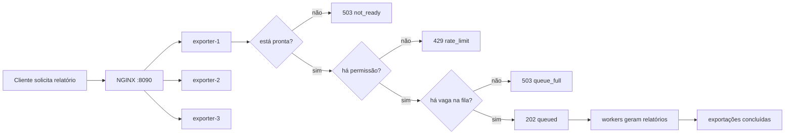

# Exercício da Aula 08 — central de exportação de relatórios

## Enunciado

Uma empresa permite que usuários solicitem relatórios grandes por HTTP. Gerar um relatório demora, então a API não mantém a requisição aberta até o arquivo ficar pronto. Ela valida o pedido, aceita a exportação em uma fila em memória e responde `202 Accepted`. Uma quantidade fixa de workers gera os arquivos em segundo plano.

Antes de continuar, estes são os nomes usados no cenário:

- **requisição:** mensagem enviada pelo cliente para pedir uma operação;
- **instância:** uma cópia do programa em execução, com memória própria;
- **NGINX:** software que recebe HTTP na frente das instâncias e encaminha cada requisição para uma delas; nesse papel, ele é o balanceador e o proxy reverso;
- **upstream:** conjunto de instâncias que podem receber uma requisição do NGINX;
- **Export:** unidade de trabalho que representa um relatório solicitado;
- **Queue ou fila:** espaço limitado em que uma Export aceita pode esperar;
- **fila fechada:** fila cuja entrada foi encerrada pelo shutdown; itens já aceitos ainda podem ser drenados;
- **channel:** mecanismo do Go usado para entregar valores entre goroutines; neste exercício, um channel com buffer implementa a fila;
- **worker:** goroutine de vida longa que retira uma exportação da fila, gera o relatório e volta a esperar;
- **Pool:** conjunto fixo de workers administrados em grupo;
- **requisição HTTP in-flight:** handler que começou a atender, mas ainda não terminou a resposta;
- **Export in-flight:** Export que já saiu da Queue e está sendo gerada por um worker;
- **handler:** função chamada pelo servidor para tratar uma rota HTTP e escrever a resposta;
- **token bucket:** recipiente lógico de permissões; cada admissão consome uma e novas permissões aparecem no ritmo configurado;
- **retry:** nova tentativa da mesma operação depois de uma rejeição ou falha;
- **drain:** período em que uma instância rejeita trabalho novo, mas continua viva para concluir o que já aceitou;
- **goodput:** quantidade de exportações concluídas com sucesso por unidade de tempo.

Uma **goroutine** é uma função executada concorrentemente pelo runtime do Go. **Concorrência** é a quantidade de trabalhos que podem estar progredindo ao mesmo tempo; **taxa** é quantos trabalhos chegam ou terminam por unidade de tempo. Dois workers não significam duas requisições por segundo: se cada exportação demora `250ms`, os dois conseguem concluir aproximadamente oito por segundo no cenário ideal.

Depois do `202`, a requisição HTTP pode já ter terminado enquanto a Export continua queued, esperando na Queue, ou in-flight, executando em um worker. O pacote Go `exports` reúne `Export`, `Queue` e `Pool`; ele não representa uma etapa adicional do fluxo.

O serviço cresceu para três instâncias atrás de um NGINX. Agora ele precisa:

- controlar quantas novas exportações entram por segundo;
- absorver somente uma espera limitada;
- explicar por HTTP por que uma solicitação foi recusada;
- informar separadamente se está vivo e se está pronto para trabalho novo;
- sair da rotação e drenar exportações aceitas ao receber `SIGTERM`;
- mostrar quantas exportações úteis realmente foram concluídas;
- configurar o NGINX para distribuir tráfego entre as três instâncias.

Sua tarefa é completar essas políticas sem alterar a fila e o worker pool já fornecidos.

## Por que o domínio é diferente da referência

A implementação de referência trabalha com pedidos e `POST /jobs`. Este exercício trabalha com relatórios e `POST /exports`.

Os nomes e o corpo JSON mudaram para exigir transferência de conhecimento:

| Referência | Exercício | Papel arquitetural |
| --- | --- | --- |
| `Job` | `Export` | unidade de trabalho assíncrona |
| `order_id` | `report` | dado recebido do cliente |
| processador de pedido | gerador de relatório | trabalho executado pelo worker |
| `/jobs` | `/exports` | endpoint de admissão |
| `api-1..3` | `exporter-1..3` | instâncias atrás do balanceador |

Você não deve copiar identificadores mecanicamente. Primeiro identifique o papel de cada componente; depois implemente o mesmo comportamento no novo domínio.

## Contrato HTTP

### Solicitar uma exportação

```http
POST /exports
Content-Type: application/json

{"report":"sales-2026"}
```

Resultados possíveis:

| Condição | Status | Corpo relevante | Cabeçalho |
| --- | --- | --- | --- |
| instância em drain | `503` | `"reason":"not_ready"` | `Retry-After: 1` |
| JSON ou `report` inválido | `400` | mensagem de validação | — |
| token bucket sem permissão | `429` | `"reason":"rate_limit"` | `Retry-After: 1` |
| fila cheia | `503` | `"reason":"queue_full"` | `Retry-After: 1` |
| exportação entrou na fila | `202` | `"status":"queued"` | — |

`202` confirma aceitação, não conclusão. O worker ainda precisa gerar o relatório.

### Estado operacional

```text
GET /livez   -> 200 enquanto o processo consegue responder
GET /readyz  -> 200 quando aceita trabalho novo; 503 durante startup ou drain
GET /stats   -> contadores locais, fila, workers, token bucket e goodput
```

Toda instância pronta precisa estar viva, mas uma instância viva pode não estar pronta. Por isso `live=true, ready=false` é o estado esperado no drain; `live=false, ready=true` seria incoerente como estado projetado.

Todas as respostas incluem `X-Instance-ID`. Quando a chamada passa pelo NGINX, ela também inclui `X-Load-Balancer: nginx`.

## Agora leia o fluxo esperado

Os termos e as respostas usados nas caixas já foram definidos acima:



O desenho mostra somente o interior de `exporter-1`; `exporter-2` e `exporter-3` executam a mesma aplicação e possuem estado local independente. “Local” significa que consumir uma permissão ou ocupar a fila de `exporter-1` não altera diretamente o token bucket nem a fila das outras duas instâncias.

As três formas de controle não são intercambiáveis:

- o token bucket limita o ritmo e a rajada que chegam à parte cara do serviço;
- a fila limita quantas exportações aceitas podem esperar;
- a quantidade de workers limita quantas exportações são geradas ao mesmo tempo.

As três barreiras do handler também não são sinônimas:

| Barreira | Pergunta | Falha observável |
| --- | --- | --- |
| prontidão da instância | este exportador aceita trabalho novo? | `503 not_ready` |
| controle de admissão | há uma permissão de ritmo agora? | `429 rate_limit` |
| capacidade de espera | há uma posição de espera agora? | `503 queue_full` |

No `compose.yaml`, cada exportador começa com rate `8/s`, burst `4`, Queue para dez itens e Pool com dois workers de `250ms`. O rate e a capacidade ideal dos workers coincidem por escolha da configuração; token bucket e Pool continuam resolvendo problemas diferentes. Os três exportadores mantêm baldes, filas e pools independentes.

Aumentar a fila compra mais tempo de espera, mas não acelera os workers. Se entram 20 exportações por segundo e os workers concluem oito, o acúmulo cresce doze por segundo até a fila encher. O comportamento saudável é rejeitar parte da entrada de forma explícita, em vez de esconder uma espera que cresce sem limite.

## O que já está pronto

```text
exercicio-aula-08/
├── cmd/
│   ├── api/main.go                   montagem e ligação dos componentes
│   └── load/main.go                  cliente de carga sem retry
├── internal/
│   ├── admission/token_bucket.go     TODOs 1 e 2
│   ├── exports/                      fila e pool prontos
│   ├── health/state.go               TODOs 3, 4 e 5
│   ├── httpapi/handler.go             TODOs 6 e 7
│   ├── lifecycle/shutdown.go          TODO 8
│   ├── telemetry/metrics.go           métricas prontas
│   └── labconfig/nginx_test.go        teste da configuração NGINX
├── deploy/nginx/default.conf          TODO 9
├── scripts/drain-instance.sh          retirada e SIGTERM prontos
├── compose.yaml                        três exportadores + NGINX
└── Makefile                            comandos de validação
```

Não altere `internal/exports`. A fila limitada e o pool fixo já foram implementados no módulo anterior e são pré-requisitos deste exercício. **Pool** é apenas o conjunto dos workers fixos; ele não cria uma nova goroutine para cada exportação.

## Preparação

Entre no módulo e execute os testes:

```bash
cd exercicio-aula-08
go test ./... -count=1
```

As falhas são esperadas. Elas mostram os contratos ainda não implementados.

Localize o trabalho pendente:

```bash
rg -n "TODO [0-9]+" . --glob '!README.md'
```

Implemente na ordem abaixo. Cada etapa possui um comando de teste focado; não espere terminar tudo para validar.

## Como trabalhar nos TODOs

Use o próprio exercício como fonte de requisitos. Para cada etapa:

1. execute o teste focado e leia a mensagem da falha;
2. leia o arquivo incompleto, seus tipos e quem chama a função;
3. escreva em palavras o comportamento esperado e os casos de erro;
4. consulte a documentação oficial da biblioteca envolvida;
5. implemente a menor solução que satisfaça o contrato;
6. execute novamente o teste e explique por que ele passou.

Não consulte a implementação pronta durante essa primeira tentativa. Ela aparece
no final deste documento para comparação posterior. Os testes informam o que deve
ser observável; decidir como coordenar as operações continua sendo parte do
exercício.

## Etapa 1 — implementar o token bucket

Arquivo: `internal/admission/token_bucket.go`.

No algoritmo, `rate` é a quantidade de permissões repostas por segundo e `burst` é a capacidade máxima do recipiente. O recipiente começa cheio. Cada `Allow` aceito consome uma permissão; o saldo pode voltar até `burst`, mas nunca deve ultrapassá-lo.

Antes de escrever código, responda:

1. O que `rate=2` repõe ao longo de um segundo?
2. O que `burst=3` limita?
3. Por que o saldo não deve crescer sem limite durante um período ocioso?
4. Por que o handler usa rejeição imediata em vez de esperar uma permissão?

Implemente os TODOs 1 e 2 para satisfazer estes comportamentos observáveis:

- uma configuração válida cria um balde que começa com a rajada disponível;
- uma configuração inválida é recusada durante a montagem: `rate` deve ser positivo e finito, e `burst` deve ser positivo;
- a decisão de admissão é imediata, sem criar espera escondida no handler;
- tempo ocioso repõe permissões sem ultrapassar a capacidade da rajada.

Não use `Sleep`, uma goroutine ou um loop de espera para fabricar o resultado.
Leia a documentação de `golang.org/x/time/rate` e escolha a operação que possui a
semântica exigida. O nome do método e a construção do objeto fazem parte da
solução.

Valide:

```bash
make test-token
```

Os testes controlam um relógio falso: em vez de aguardar o relógio real, o teste
decide qual horário a função enxerga. Use os cenários para deduzir a relação entre
tempo, reposição e capacidade máxima.

Aqui, **finito** exclui `NaN` (“não é um número”) e os infinitos. Esses valores
existem em `float64` e precisam ser tratados como configuração inválida, mesmo
quando a conversão textual não devolve erro.

## Etapa 2 — implementar readiness concorrente

Arquivo: `internal/health/state.go`.

O mesmo objeto é lido por handlers HTTP e alterado pelo fluxo de inicialização ou shutdown. Implemente os TODOs 3, 4 e 5 usando o campo atômico já fornecido.

Contrato:

```text
NewState       -> not-ready
MarkReady      -> ready
MarkNotReady   -> not-ready
Ready          -> leitura segura do estado atual
```

Não troque o campo por um `bool` comum. Uma **data race** ocorre quando goroutines acessam a mesma memória concorrentemente e pelo menos uma escreve sem sincronização adequada. O teste funcional pode até passar, mas o detector de corridas deve continuar seguro quando várias goroutines consultarem o estado.

Valide:

```bash
make test-health
```

## Etapa 3 — traduzir admissão para HTTP

Arquivo: `internal/httpapi/handler.go`.

Implemente os TODOs 6 e 7. Os dois **helpers**, pequenas funções auxiliares usadas para isolar uma decisão, retornam um booleano:

- `true`: o helper já escreveu a resposta e o handler deve parar;
- `false`: a requisição pode seguir para a próxima decisão.

O contrato HTTP no início deste documento define as respostas esperadas para
instância não pronta e falta de permissão. Descubra, pelo `Handler`, quais
dependências fornecem essas decisões e quais colaboradores registram o resultado.

Antes de implementar, responda:

1. Em qual caminho o helper deve afirmar que já encerrou a requisição?
2. Em qual caminho ele deve permitir que `enqueue` continue?
3. Como impedir que uma requisição rejeitada chegue à fila?
4. Que comportamento existente do caminho de fila cheia pode servir como padrão
   de tradução para HTTP, sem ser copiado como a mesma decisão?

Valide:

```bash
make test-http
```

Não altere o caminho de fila cheia: ele já demonstra a diferença entre `429` e `503`.

## Etapa 4 — coordenar o shutdown gracioso

Arquivo: `internal/lifecycle/shutdown.go`.

Implemente o TODO 8. `Steps` contém funções fornecidas por quem chama
`lifecycle.Shutdown`; o package `lifecycle` deve coordená-las sem recriar servidor,
fila ou workers. O `ctx` recebido limita quanto tempo o encerramento pode usar.

Descubra as implementações concretas lendo `cmd/api/main.go`. Depois leia
`internal/exports/queue.go`, `internal/exports/pool.go` e os testes de lifecycle.
Não procure ainda o arquivo equivalente na implementação de referência.

Sua solução precisa preservar estes invariantes:

- uma configuração incompleta não pode deixar o serviço parcialmente encerrado;
- trabalho novo deve parar de entrar antes que a infraestrutura de processamento
  seja desmontada;
- o caminho normal deve impedir que produtores HTTP alcancem uma fila fechada;
- exportações que receberam `202` devem ter oportunidade de terminar;
- o prazo deve impedir espera indefinida;
- o caminho forçado não pode deixar goroutines do Pool esquecidas;
- um erro posterior não pode apagar um erro anterior.

Derive a ordem a partir desses invariantes e dos testes. Antes de programar,
desenhe quais componentes ainda podem produzir ou consumir uma Export em cada
momento. A sequência resultante é parte central do exercício.

A Queue já fornecida possui uma defesa para o caminho forçado: `Close` é
idempotente e sincronizado com `TryEnqueue`; uma tentativa atrasada devolve
`ErrQueueClosed`, e o Handler já fornecido traduz esse resultado para
`503 not_ready`. Isso evita um panic concorrente, mas não substitui a ordem
correta que o TODO 8 deve descobrir.

Valide:

```bash
make test-shutdown
```

## Etapa 5 — completar o upstream do NGINX

Arquivo: `deploy/nginx/default.conf`.

Implemente o TODO 9 para que o upstream:

- possa encaminhar tráfego às três instâncias;
- favoreça o destino com menos conexões HTTP ativas;
- mantenha uma política coerente de falha passiva para todos os destinos.

Use a documentação oficial do NGINX e o teste deste módulo para descobrir as
diretivas e os parâmetros exigidos. A linha já existente mostra o formato básico
de um destino, mas completar o bloco faz parte da solução.

O resultado deve possuir exatamente estes papéis:

```text
cliente -> NGINX :8090 -> exporter-1 | exporter-2 | exporter-3
```

O algoritmo pedido conhece conexões HTTP, mas não conhece permissões, profundidade
da Queue nem Exports nos workers. Como `POST /exports` responde `202` rapidamente,
uma conexão pode terminar no NGINX enquanto a geração continua no Pool. O NGINX
deste laboratório também não consulta `/readyz` sozinho; o script de drain retira
a instância explicitamente antes de pedir ao Docker que entregue `SIGTERM`.

O healthcheck do Compose consulta `/readyz` periodicamente. A condição `service_healthy` serve para o NGINX esperar os exportadores na inicialização, mas não reescreve o upstream durante o drain; essa retirada é responsabilidade do script neste laboratório.

Valide o contrato textual:

```bash
make test-nginx
```

Depois que o laboratório estiver no ar, o próprio NGINX também validará a sintaxe com `nginx -t` durante o script de drain.

## Etapa 6 — validar o conjunto

Quando os testes focados passarem:

```bash
make test
make race
make vet
```

Critérios de aceite:

- todos os testes passam;
- não existe data race;
- todos os TODOs numerados foram implementados;
- `go vet` não encontra problema;
- os arquivos de teste não foram alterados;
- fila e worker pool prontos não foram reimplementados;
- não foi criada espera ilimitada dentro do handler.

## Etapa 7 — executar o laboratório completo

Suba os três exportadores e o NGINX:

```bash
make lab-up
```

Portas:

| Porta | Processo |
| ---: | --- |
| `8090` | NGINX, entrada usada pelo cliente |
| `8091` | `exporter-1` diretamente |
| `8092` | `exporter-2` diretamente |
| `8093` | `exporter-3` diretamente |

Gere carga:

```bash
make load
```

O relatório deve listar as três instâncias. Consulte as métricas locais:

```bash
make stats
```

Compare:

- `accepted_202`: exportações aceitas;
- `rate_limited_429`: excesso barrado antes da fila;
- `queue_full_503`: falta de capacidade de espera;
- `completed`: exportações úteis concluídas;
- `goodput_exports_per_second`: conclusão útil por segundo desde o início.

## Etapa 8 — demonstrar drain e SIGTERM

Execute:

```bash
make drain-exporter-2
```

O comando chama `scripts/drain-instance.sh exporter-2`. O script:

1. marca `exporter-2` como `down` no upstream;
2. valida e recarrega o NGINX;
3. executa `docker compose stop -t 15 exporter-2`;
4. o Docker entrega `SIGTERM` ao processo Go do exportador;
5. a aplicação chama `lifecycle.Shutdown` e tenta drenar dentro de `SHUTDOWN_TIMEOUT`.

O sinal não é enviado pelo NGINX. O NGINX apenas deixa de escolher o destino; o Docker controla o ciclo de vida do container.

Em `cmd/api/main.go`, `signal.NotifyContext` é registrado no início de `run()`,
antes da criação dos componentes e de `MarkReady`. Se `SIGTERM` chegar durante a
inicialização, a captura desvia a ação padrão abrupta e cancela o contexto. Se o
cancelamento já estiver visível no ponto de prontidão, `MarkReady` é ignorado; de
qualquer modo, o `select` inicia o shutdown assim que observa o sinal.

Com os valores padrão:

```text
DRAIN_DELAY=1s       -> intervalo entre not-ready e fechamento HTTP
SHUTDOWN_TIMEOUT=10s -> prazo interno de todo o algoritmo Go
docker stop -t 15    -> prazo externo antes de o Docker forçar SIGKILL
```

O `stop_grace_period: 12s` do `compose.yaml` é o padrão para outras paradas; o `-t 15` explícito é usado por esta chamada do experimento.

Gere carga novamente. Somente `exporter-1` e `exporter-3` devem aparecer.

Restaure o cenário:

```bash
make lab-reset
```

Ao terminar:

```bash
make lab-down
```

## Perguntas para entregar com o código

1. Por que uma fila de 10.000 itens não corrige workers que processam menos itens por segundo do que chegam?
2. Qual é a diferença observável entre `429 rate_limit` e `503 queue_full`?
3. Por que o token bucket deste exercício cria uma cota local por exportador, e não uma cota global exata?
4. Durante o drain, por que `/livez` continua `200` enquanto `/readyz` passa a `503`?
5. Qual trabalho pode ser perdido porque a fila é um channel em memória?
6. Por que repetir automaticamente um `POST /exports` pode duplicar uma exportação? Relacione sua resposta a **idempotência**, a propriedade de repetir a mesma intenção sem criar efeitos adicionais.
7. O que o NGINX faz neste laboratório e o que continua sendo responsabilidade da aplicação Go?

## Referência depois da tentativa

Depois de completar ou registrar onde ficou bloqueado, compare os papéis com `../aula-08-confiabilidade`. A referência usa outro domínio de propósito. Compare decisões e ordem de execução, não apenas linhas ou nomes.

## Fontes para consulta

- [Go `net/http.Server.Shutdown`](https://pkg.go.dev/net/http#Server.Shutdown): fechamento de listeners e espera por conexões ativas;
- [Go `signal.NotifyContext`](https://pkg.go.dev/os/signal#NotifyContext): transformação de SIGTERM em cancelamento de contexto;
- [Go `strconv.ParseFloat`](https://pkg.go.dev/strconv#ParseFloat): conversão de taxas, incluindo os valores especiais `NaN` e infinito;
- [Go `math.IsNaN` e `math.IsInf`](https://pkg.go.dev/math): identificação de valores não finitos;
- [Docker `docker compose stop`](https://docs.docker.com/reference/cli/docker/compose/stop/): seleção do serviço e timeout de parada;
- [NGINX HTTP load balancing](https://nginx.org/en/docs/http/load_balancing.html): upstream, round-robin e least connections.
