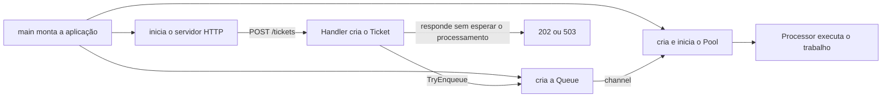

# Exercício: fila limitada e worker pool

Uma cozinha recebe comandas mais rápido do que consegue preparar os pratos. Se o caixa tentar cozinhar dentro da própria requisição HTTP, o cliente fica conectado durante todo o preparo. Se o caixa criar uma goroutine sem limite para cada comanda, a sobrecarga apenas muda de lugar: muitos preparos passam a disputar CPU, memória e dependências ao mesmo tempo.

Neste exercício, o caixa aceita somente o trabalho que cabe em uma fila limitada. Uma quantidade fixa de cozinheiros retira as comandas da fila e prepara os pratos em segundo plano.

```text
POST /tickets
      ↓
Handler cria um Ticket
      ↓
Queue tenta aceitar sem bloquear
      ├── entrou na fila → 202 Accepted
      └── fila cheia    → 503 Service Unavailable

Quantidade fixa de workers
      ↓
retira Tickets da Queue
      ↓
Processor simula o preparo
```

`202 Accepted` confirma que a comanda entrou na fila. Não confirma que o prato já foi preparado. `503 Service Unavailable` com `Retry-After` informa que não existe capacidade de espera naquele momento.

## Os nomes usados no exercício

- **Ticket:** os dados de uma comanda aceita para processamento;
- **produtor:** quem tenta colocar trabalho na fila; neste projeto é o Handler HTTP;
- **Queue:** a fila em memória onde tickets aceitos podem esperar;
- **capacidade ou buffer:** número máximo de tickets que podem estar esperando dentro da Queue;
- **worker ou cozinheiro:** uma goroutine de vida longa que retira e processa um ticket por vez;
- **Pool:** conjunto com quantidade fixa de workers;
- **Processor:** função chamada pelo worker para realizar o trabalho; aqui ela apenas simula o tempo de preparo.

Um ticket que já saiu da Queue e está com um worker não ocupa mais o buffer. Com capacidade 20 e quatro workers, podem existir até 20 tickets esperando e quatro sendo preparados ao mesmo tempo.

## Antes de implementar: como ler o projeto do exercício

Não comece pelos `TODO`. Primeiro descubra como os componentes já prontos esperam usar a Queue e o Pool. Leia um caminho de execução, não os arquivos em ordem alfabética:

1. [`cmd/api/main.go`](cmd/api/main.go): em `run`, observe a criação da Queue, do Processor, do Pool e do Handler. Na primeira leitura, pare quando o servidor HTTP estiver montado; o restante coordena o encerramento e já está pronto;
2. [`internal/kitchen/ticket.go`](internal/kitchen/ticket.go): veja quais dados atravessam o channel;
3. [`internal/httpapi/handler.go`](internal/httpapi/handler.go): acompanhe `POST /tickets` até a chamada de `TryEnqueue` e até as respostas 202 ou 503;
4. [`internal/kitchen/queue.go`](internal/kitchen/queue.go): leia comentários, assinaturas e `ErrQueueFull`, mas deixe os `TODO` para as etapas seguintes;
5. [`internal/kitchen/pool.go`](internal/kitchen/pool.go): veja as dependências já guardadas em `Pool` e o papel de `Start` e `Wait`;
6. [`internal/kitchen/processor.go`](internal/kitchen/processor.go): confirme que o preparo é apenas uma espera cancelável, não uma funcionalidade de restaurante;
7. [`cmd/load/main.go`](cmd/load/main.go): deixe para o final. Ele é somente um cliente que envia várias requisições à API.

A montagem acontece uma vez, antes de a API receber tráfego. Depois disso, requisições e workers executam em goroutines diferentes:



Há duas goroutines independentes:

```text
Goroutine da requisição HTTP
└── Handler
    └── TryEnqueue
        └── envia o trabalho pelo channel

Goroutines do Pool
└── recebem do mesmo channel
    └── chamam o Processor
```

O Handler não chama um worker diretamente. Ele envia um `Ticket` pelo channel. Uma goroutine do Pool que estava esperando recebe esse valor. A resposta HTTP pode terminar enquanto o preparo continua no mesmo processo, em outra goroutine.

## O que já está pronto

```text
exercicio/
├── cmd/
│   ├── api/main.go              montagem, servidor e encerramento
│   └── load/main.go             cliente que produz carga
└── internal/
    ├── config/config.go         quantidade de workers e capacidade da fila
    ├── httpapi/handler.go       POST /tickets e GET /health
    └── kitchen/
        ├── ticket.go            unidade de trabalho
        ├── processor.go         preparo simulado
        ├── queue.go             fila a implementar
        └── pool.go              Start a implementar
```

A API HTTP, a configuração, o cliente de carga, o `Processor`, a montagem e o encerramento já estão prontos. Não há banco, broker, processamento em lote ou telemetria neste exercício.

Os arquivos `*_test.go` são a especificação executável do exercício. Leia o nome e a mensagem de falha do teste, mas não altere os testes para fazê-los passar.

As alterações devem ficar em:

1. [`internal/kitchen/queue.go`](internal/kitchen/queue.go);
2. método `Start` de [`internal/kitchen/pool.go`](internal/kitchen/pool.go).

Os comentários desses arquivos descrevem os contratos. Os testes observam o comportamento externamente; eles não exigem nomes específicos para variáveis locais.

## Preparação

Entre na pasta do exercício:

```bash
# partindo da raiz do repositório aula-arquitetura-api-pedidos
cd exercicio
```

Execute todos os testes uma vez:

```bash
go test ./... -count=1
```

`-count=1` força uma nova execução e evita que o Go reutilize um resultado anterior do cache de testes.

Os pacotes que constroem uma Queue falharão em `TODO: implemente NewQueue`. A falha é esperada neste momento: ela mostra o primeiro comportamento que ainda precisa ser implementado.

Localize o trabalho pendente:

```bash
rg -n "TODO" internal/kitchen
```

Se `rg` não estiver instalado, use a busca da IDE pela palavra `TODO`.

## Etapa 1 — criar a fila com capacidade fixa

Abra [`internal/kitchen/queue.go`](internal/kitchen/queue.go).

Implemente a estrutura de `Queue`, `NewQueue`, `Depth` e `Capacity`.

A fila precisa:

- guardar valores do tipo `Ticket`;
- possuir buffer com a capacidade recebida no construtor;
- começar vazia;
- causar `panic` ao receber capacidade menor ou igual a zero;
- informar quantos itens estão esperando agora;
- informar a capacidade fixa do buffer.

Use o channel com buffer oferecido pela própria linguagem; não implemente uma lista e não adicione mutex à Queue. O valor informado ao criar o channel define quantos tickets podem esperar. Para channels, as funções nativas `len` e `cap` informam, respectivamente, a ocupação atual do buffer e sua capacidade fixa.

`Depth` representa somente os tickets que continuam no buffer. Um ticket já retirado por um cozinheiro não faz parte dessa contagem.

O `panic` deste construtor representa erro de programação ou configuração durante a inicialização. Ele não é usado para recusar uma requisição HTTP: a capacidade é escolhida antes de o servidor começar.

Valide esta etapa:

```bash
go test ./internal/kitchen -run '^TestNewQueue' -v -count=1
```

`-run` filtra os testes pelo nome; `-v` mostra cada teste executado.

Os dois testes devem passar antes de continuar.

## Etapa 2 — aceitar sem bloquear e rejeitar quando estiver cheia

Implemente `TryEnqueue`.

O caixa não pode ficar esperando uma vaga. A tentativa possui somente dois resultados:

- se o channel puder receber imediatamente, o ticket é aceito;
- se o buffer estiver cheio naquele instante, o método devolve `ErrQueueFull`.

Em Go, `select` observa operações de channel. Um `case` de envio pode prosseguir quando existe vaga; `default` é escolhido imediatamente quando nenhum `case` está pronto. Essa combinação permite tentar o envio sem colocar o Handler para esperar.

Use essa seleção não bloqueante para decidir entre aceitar e devolver `ErrQueueFull`. Não crie goroutine e não use `Sleep`: essas alternativas esconderiam a sobrecarga em vez de recusá-la.

Valide esta etapa:

```bash
go test ./internal/kitchen -run '^TestQueueTryEnqueue' -v -count=1
```

O teste preenche uma fila de capacidade dois e verifica que o terceiro ticket é recusado sem alterar a profundidade.

## Etapa 3 — entregar uma visão de leitura e encerrar a fila

Implemente `Tickets` e `Close`.

`Tickets` deve permitir que o Pool receba tickets, mas não deve lhe dar permissão para enviar nem fechar o channel. Na assinatura pronta, `<-chan Ticket` significa “channel do qual se pode somente receber”. A seta aponta do channel para quem lê.

`Close` informa que nenhuma nova comanda será enviada. Fechar não apaga o buffer: os consumidores ainda conseguem retirar os tickets aceitos e, depois da drenagem, recebem o sinal de que o channel terminou.

O channel preserva FIFO (*first in, first out*): o primeiro ticket colocado é o primeiro disponível para retirada. Com vários workers, isso não garante a mesma ordem de conclusão, pois um prato pode demorar mais que outro.

O `main` é responsável pela ordem segura do encerramento:

```text
parar novas requisições HTTP
        ↓
fechar a Queue
        ↓
workers drenam os Tickets aceitos
        ↓
Pool.Wait retorna
```

Valide esta etapa:

```bash
go test ./internal/kitchen -run '^TestQueueClose' -v -count=1
```

O teste confirma a ordem FIFO dos tickets já aceitos e verifica que o channel sinaliza fechamento depois de esvaziar.

## Etapa 4 — verificar o contrato HTTP que depende da fila

Nenhuma mudança no Handler é necessária. Execute:

```bash
go test ./internal/httpapi -v -count=1
```

Os testes confirmam:

- prato válido e espaço disponível resultam em `202 Accepted`;
- fila cheia resulta em `503 Service Unavailable` e `Retry-After: 1`;
- prato vazio resulta em `400 Bad Request`.

Se essa etapa falhar, volte à fila. O Handler apenas traduz `ErrQueueFull` para HTTP.

`Retry-After: 1` orienta o cliente a aguardar aproximadamente um segundo antes de tentar novamente. A API não guarda nem repete automaticamente o ticket recusado.

## Etapa 5 — iniciar uma quantidade fixa de cozinheiros

Abra [`internal/kitchen/pool.go`](internal/kitchen/pool.go) e implemente somente `Start`. `NewPool` reúne as dependências e `Wait` já espera o `WaitGroup`.

Antes de implementar, separe o papel de três mecanismos:

- **goroutine:** executa um cozinheiro concorrentemente;
- **WaitGroup:** conta quantas goroutines de cozinheiros ainda não terminaram; ele não conta tickets;
- **contexto:** leva um sinal de cancelamento até os workers pelo channel retornado por `ctx.Done()`.

Para cada worker, `Add(1)` registra uma goroutine antes de ela começar. Quando essa goroutine termina, `Done()` reduz o contador. Durante o encerramento, `Wait()` bloqueia até o contador chegar a zero. `Start` deve apenas iniciar os workers e retornar; não chame `Wait` dentro dele, pois isso impediria o `main` de iniciar o servidor HTTP.

Ao receber de um channel, Go pode devolver o valor e um booleano. O booleano é verdadeiro enquanto um ticket foi recebido. Ele se torna falso depois que o channel foi fechado e todos os valores armazenados foram retirados. Esse é o sinal de encerramento normal da fila.

Ao iniciar, o Pool deve criar exatamente a quantidade configurada em `cooks`. Cada cozinheiro é uma goroutine de vida longa que repete este ciclo:

```text
espera um Ticket ou o cancelamento
        ↓
se recebeu Ticket, chama o Processor
        ↓
volta a esperar o próximo
```

Para cada cozinheiro:

1. incremente o `WaitGroup` antes de iniciar a goroutine;
2. garanta que a goroutine sinalize `Done` quando terminar;
3. espere pelo cancelamento do contexto ou por um ticket;
4. ao receber do channel, examine também o indicador de channel aberto;
5. saia quando o contexto for cancelado ou quando a fila fechada terminar de drenar;
6. execute o `Processor` dentro da própria goroutine do cozinheiro;
7. depois do processamento, volte a esperar outro ticket.

Não crie uma nova goroutine por ticket. Isso removeria o limite de concorrência: quatro cozinheiros poderiam disparar centenas de preparos simultâneos.

`Processor` devolve `error` para manter um contrato realista, mas novas tentativas e registro de falhas estão fora deste exercício. `Start` deve chamá-lo e continuar o ciclo; não crie uma nova política de falha.

Primeiro confirme que todos os tickets aceitos são drenados:

```bash
go test ./internal/kitchen -run '^TestPoolDrainsQueue$' -v -count=1
```

Depois confirme que dois cozinheiros nunca executam três tickets simultaneamente:

```bash
go test ./internal/kitchen -run '^TestPoolRespectsWorkerLimit$' -v -count=1
```

Por fim, confirme que workers ociosos saem quando o contexto é cancelado:

```bash
go test ./internal/kitchen -run '^TestPoolStopsWhenContextIsCanceled$' -v -count=1
```

Você também pode executar os três testes de Pool juntos:

```bash
go test ./internal/kitchen -run '^TestPool' -v -count=1
```

## Etapa 6 — validar o conjunto e procurar corridas

Execute todo o módulo:

```bash
go test ./... -count=1
```

Depois execute o detector de corridas:

```bash
go test -race ./... -count=1
```

O detector procura acessos concorrentes sem sincronização adequada. Ele é importante aqui porque Handler, Queue e workers executam em goroutines diferentes.

Todos os testes precisam terminar. Um teste de Pool que fica parado normalmente indica uma destas situações:

- o worker não verifica se o channel foi fechado;
- o contexto cancelado não participa da espera;
- `Done` não é executado em todos os caminhos de saída;
- `Add` foi feito dentro da goroutine, tarde demais para um `Wait` concorrente.

## Etapa 7 — observar aceitação e sobrecarga pela API

Com os testes verdes, inicie a aplicação:

```bash
make run
```

Em outro terminal, envie uma carga pequena:

```bash
make load-small
```

O programa `cmd/load` também usa goroutines, mas elas representam clientes fazendo requisições HTTP. Elas não são os cozinheiros do servidor. A opção `concurrency` controla quantos clientes podem requisitar ao mesmo tempo; `COOKS` controla quantos tickets a API prepara simultaneamente.

O relatório deve mostrar somente ou principalmente respostas `202`.

Depois envie uma rajada:

```bash
make load-overload
```

Como a fila é limitada, parte das requisições deve receber `503`. Os trabalhos aceitos continuam sendo preparados; os rejeitados nunca entraram na fila.

Compare também dois ritmos sustentados:

```bash
make load-steady-ok
make load-steady-overload
```

Com quatro cozinheiros e aproximadamente 100 ms por prato, a capacidade didática fica perto de 40 pratos por segundo. A fila absorve uma diferença temporária, mas uma entrada sustentada acima dessa saída termina em rejeição.

A latência exibida pelo cliente é a latência do caixa para aceitar ou recusar. Ela não inclui o tempo de preparo, pois o processamento é assíncrono.

## O que cada teste protege

| Teste | Comportamento observado |
| --- | --- |
| `TestNewQueueCreatesEmptyBufferWithCapacity` | construtor, profundidade inicial e capacidade |
| `TestNewQueueRejectsInvalidCapacity` | falha antecipada para configuração inválida |
| `TestQueueTryEnqueueAcceptsUntilFull` | buffer limitado e rejeição não bloqueante |
| `TestQueueCloseDrainsAcceptedTicketsAndClosesChannel` | FIFO, drenagem e sinal de fechamento |
| `TestEnqueueReturnsAccepted` | tradução de fila disponível para HTTP 202 |
| `TestEnqueueReturnsServiceUnavailableWhenQueueIsFull` | tradução de `ErrQueueFull` para HTTP 503 |
| `TestEnqueueRejectsEmptyDish` | validação do contrato de entrada |
| `TestPoolDrainsQueue` | consumo de todos os tickets aceitos |
| `TestPoolRespectsWorkerLimit` | concorrência limitada pela quantidade de cozinheiros |
| `TestPoolStopsWhenContextIsCanceled` | encerramento de workers que estavam esperando |

## Critérios de conclusão

O exercício está concluído quando:

- não existem `TODO` em `internal/kitchen`;
- todos os testes comuns passam;
- o detector de corridas passa;
- carga pequena é aceita;
- sobrecarga produz rejeição controlada, sem criar goroutines sem limite;
- interromper a aplicação permite drenar o que já foi aceito dentro do prazo de encerramento.

## Limite do exercício

A Queue usa memória do próprio processo. Se a aplicação encerrar abruptamente, tickets ainda não processados são perdidos. Trabalhos que precisam sobreviver a reinícios exigem uma fila durável, confirmação de que a mensagem foi armazenada, possibilidade de entregá-la novamente após falhas e um destino para mensagens que continuam falhando. Essas responsabilidades não devem ser adicionadas a este exercício.

## Comparação depois do exercício

Somente depois de deixar os testes verdes, compare sua solução com [`../aula-fila-worker-pool`](../aula-fila-worker-pool). O projeto da aula acrescenta lote, métricas e logs, por isso não deve ser copiado para resolver esta versão menor. Na comparação, procure apenas três propriedades: fila com capacidade fixa, envio não bloqueante e quantidade fixa de workers.
